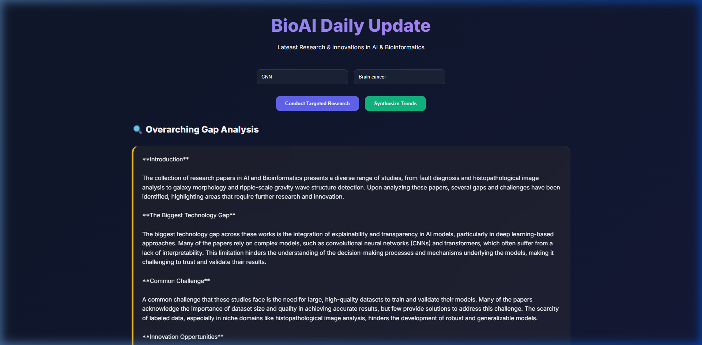
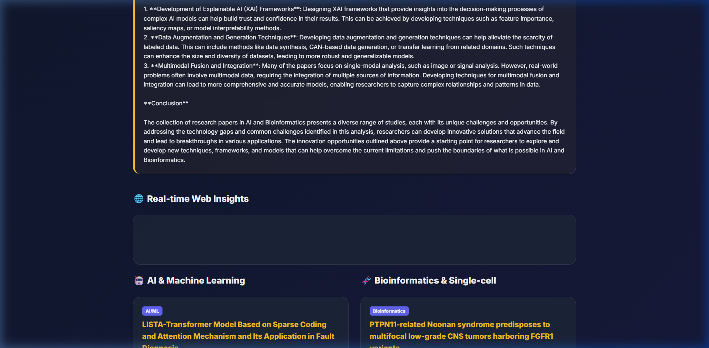
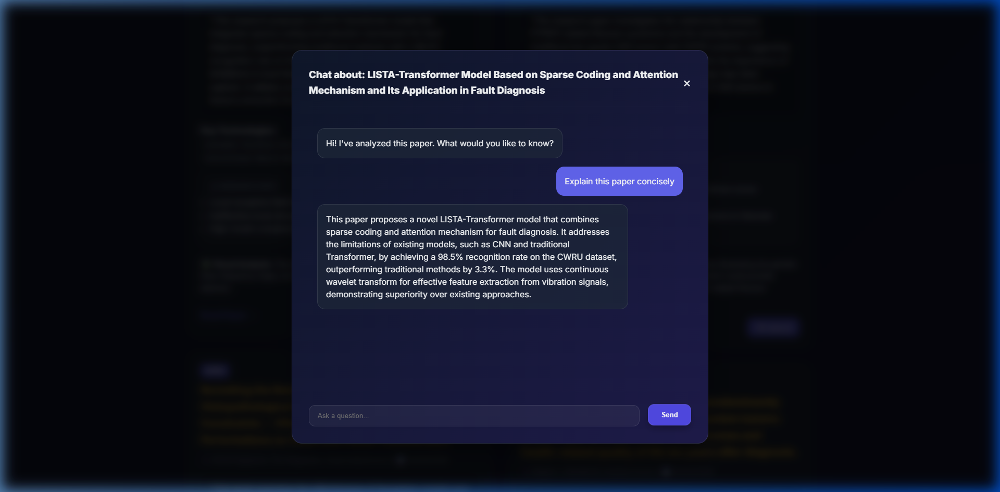

# BioAI Daily Update 🧬🤖

A high-performance, AI-driven research dashboard that monitors the latest innovations in **Bioinformatics** (Single-cell, Cancer) and **Artificial Intelligence** (LLMs, GNNs) in real-time.

## 🚀 Key Features

- **Multi-Source Research Fetching**: Automatically parses the latest papers from **arXiv**, **PubMed**, and **bioRxiv**.
- **Context-Aware AI Chat**: Click "💬 Ask AI" on any paper to start a deep-dive conversation about its contents using **Groq (Llama 3.3)**.
- **Dynamic Research Topics**: Users can specify custom AI and Bio topics (e.g., "Alzheimer's", "Ollama", "GNNs") for targeted research.
- **Overarching Gap Analysis**: Analyzes all fetched papers collectively to identify the "Missing Link" and overarching technology gaps in the field.
- **Real-time Trend Synthesis**: A dedicated "Synthesize Trends" engine to summarize the absolute latest innovations from the live web.
- **SQLite Persistence**: All research history and AI insights are securely stored in a local database.
- **Premium UI**: Modern, glassmorphic dashboard built with Vanilla CSS and smooth micro-animations.

## 📸 Demo

### 1. Targeted Research & Trends


### 2. Personalized Insights Dashboard


### 3. Interactive Paper Chat


## 🛠️ Tech Stack

- **Backend**: FastAPI (Python)
- **AI Brain**: Groq Cloud SDK (Llama-3.3-70b-versatile)
- **Database**: SQLAlchemy + SQLite
- **Frontend**: Vanilla HTML5, CSS3 (Glassmorphism), and JavaScript (ES6)
- **Research APIs**: arXiv API, Entrez (PubMed) E-utilities

## ⚙️ Installation & Setup

### 1. Clone the Repository
```bash
git clone https://github.com/Mujahidul-islam-IU/bio_AI_daily_update.git
cd bio_AI_daily_update
```

### 2. Configure API Key
In `backend/main.py`, replace the `GROQ_API_KEY` with your own key from [Groq Cloud](https://console.groq.com/).

### 3. Run the Backend
```bash
cd backend
pip install -r requirements.txt
python -m uvicorn main:app --host 127.0.0.1 --port 8000
```

### 4. Run the Frontend
```bash
cd ../frontend
python serve_frontend.py
```
Visit **http://localhost:3000** in your browser.

## 📄 License
This project is licensed under the MIT License.
